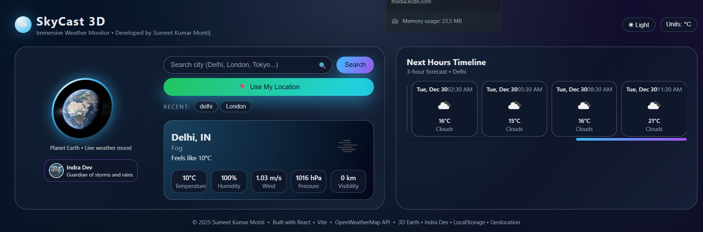
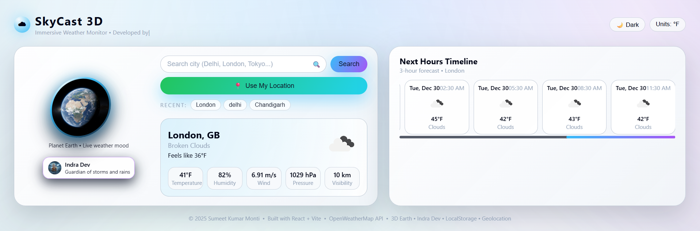

🌤️ Skycast 3D Weather

A Modern 3D Weather Web Application

Skycast 3D Weather is a modern, high-performance weather application built using React and Vite. It provides real-time weather data through the Weather.com API and displays it using a clean, visually rich, and 3D-styled user interface. The goal of this project is to combine accurate live weather information with a smooth and engaging user experience.

Live Demo
https://skycast-3d-weather-pboixzv6y-sumeet-kumar-montis-projects.vercel.app/

📖 About the Project

Skycast 3D Weather was created to demonstrate modern frontend development, real-time API integration, and attractive UI design. The application is designed to feel like a real product, not just a demo. It loads quickly, adapts beautifully to different screen sizes, and presents weather data in a clear and interactive way.

✨ Features

Real-time temperature and weather conditions
Location-based weather updates
Modern 3D-inspired user interface
Fast and optimized performance using Vite
Fully responsive design for mobile and desktop

🛠️ Technology Stack

HTML
CSS
JavaScript
React
Vite
Weather.com API
Netlify

📸 Application Screenshots

Below are some previews of the Skycast 3D Weather application.

🔐 API and Security

The application connects to the Weather.com API to fetch real-time weather data. The API key is stored securely using environment variables and is not included in the GitHub repository. This ensures the key is not exposed to the public and follows best security practices.

🚀 Deployment

Skycast 3D Weather is deployed on Netlify, providing fast global hosting and continuous deployment from GitHub. Every update to the main branch can be automatically built and deployed.

👨‍💻 Developer

SUMEET KUMAR MONTI
Full Stack MERN Developer

LinkedIn
https://www.linkedin.com/in/sumeetkumarmonti932003

GitHub
https://github.com/SUMEETKUMARMONTI
